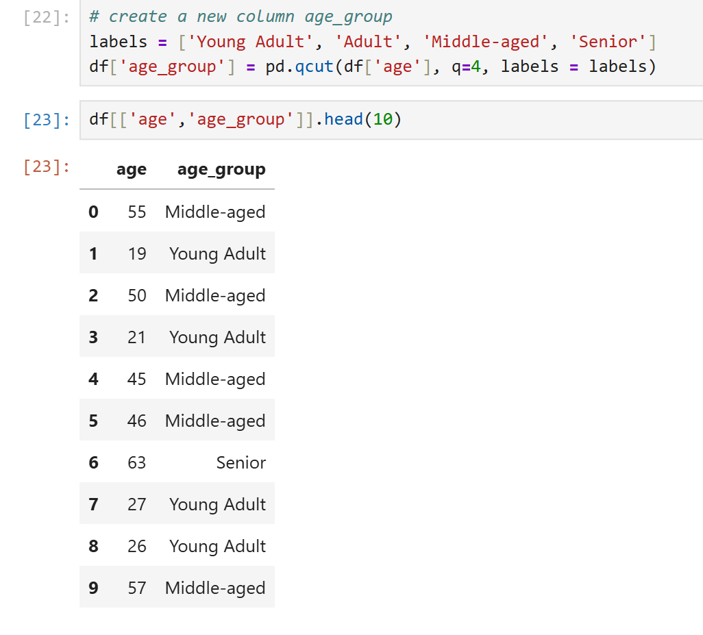
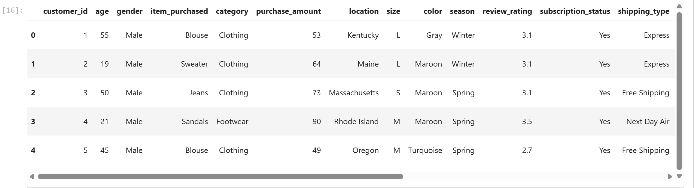
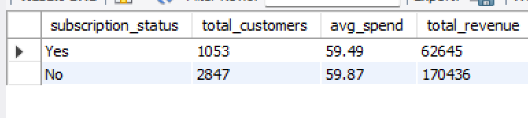
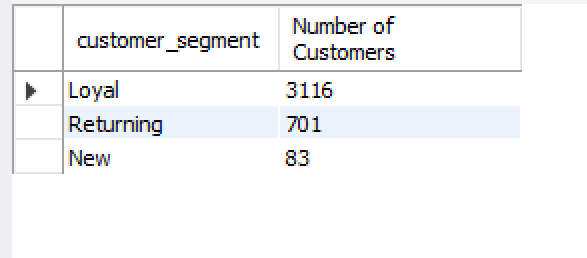
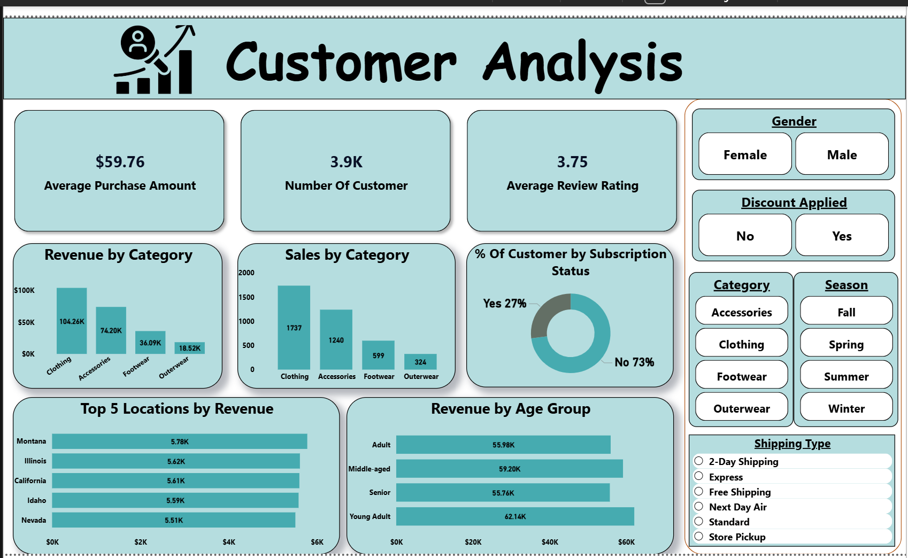

# 🛍️ **Customer Shopping Analysis**


---

## 📘 **Project Overview**

This project analyzes **customer shopping behavior** for a retail company using a dataset of **3,900 transactions**.
The goal is to uncover spending trends, customer segments, and behavioral factors that influence loyalty and revenue.

The analysis combines:

* 🐍 **Python** for data cleaning and transformation
* 🧮 **SQL** for analytical querying
* 📊 **Power BI** for visualization and dashboarding

Together, these tools form a complete end-to-end data pipeline.

---

## 🎯 **Business Problem**

The company wanted to understand:

* What drives customers to spend more — **discounts, quality, subscriptions, or shipping convenience**?
* Which demographics and product categories contribute most to total revenue?
* How can data insights improve **marketing, pricing, and retention strategies**?

---

## 🧩 **Dataset Summary**

| Feature            | Description                                                                                                         |
| ------------------ | ------------------------------------------------------------------------------------------------------------------- |
| **Rows**           | 3,900                                                                                                               |
| **Columns**        | 18                                                                                                                  |
| **Key Attributes** | Gender, Age, Subscription Status, Item Purchased, Category, Purchase Amount, Discount, Review Rating, Shipping Type |
| **Missing Data**   | 37 missing values in Review Rating                                                                                  |

---

## ⚙️ **Methodology**

### 🐍 **Phase 1 — Data Preparation (Python)**

* Cleaned and standardized data (3,900 rows)
* Handled missing values, created features (`age_group`, `discount_applied`, `purchase_frequency_days`)
  <p align="center">
  
</p>
* Performed EDA using Pandas and Matplotlib
 <p align="center">
  
</p>

### 🧮 **Phase 2 — Data Analysis (SQL)**

* Executed **10 SQL queries** targeting:

  * Gender-wise revenue
  * Discount impact
  * Shipping preference
  * Subscription performance
     <p align="center">
  
</p>
  * Customer segmentation and loyalty
 <p align="center">
  
</p>
* Aggregated insights on spending and demographic patterns

### 📊 **Phase 3 — Visualization (Power BI)**

* Built interactive dashboards for:

  * Revenue by gender and age group
  * Discounted vs. non-discounted sales
  * Top-performing products and categories
  * Subscription performance and loyalty segmentation
     <p align="center">
  
</p>

---

## 📈 **Results & Insights**

| Metric                         | Key Finding                                                                   |
| ------------------------------ | ----------------------------------------------------------------------------- |
| **Total Revenue**              | $233,081                                                                      |
| **Average Purchase**           | $59.76                                                                        |
| **Gender Split**               | Males: $157,890 (68%), Females: $75,191 (32%)                                 |
| **Shipping Type**              | Express: $60.48 avg spend, Standard: $58.46                                   |
| **Top Discounted Products**    | Hat (50%), Sneakers (49.66%), Coat (49.07%), Sweater (48.17%), Pants (47.37%) |
| **Customer Segments**          | Loyal: 3,116 • Returning: 701 • New: 83                                       |
| **Top Age Group**              | Young Adults (18–35) — $62,143 revenue                                        |
| **Repeat Buyers (Subscribed)** | 958 subscribed vs. 2,518 non-subscribed                                       |

**Overall Insight:**
Loyal and subscribed customers drive the majority of revenue, while young adults are the most profitable demographic.
Convenience (express shipping) and strategic discounts significantly influence purchasing behavior.

---

## 💡 **Business Recommendations**

1. 🎯 **Target High-Value Customers** – Focus promotions and personalized discounts on loyal, high-spending buyers.
2. 💳 **Encourage Subscriptions** – Offer exclusive benefits (free shipping, early access) to increase recurring revenue.
3. 🚚 **Optimize Shipping Options** – Promote express delivery bundles to attract high-spending convenience-driven shoppers.
4. 👩‍💻 **Age-Focused Marketing** – Prioritize campaigns targeting the 18–35 demographic through digital channels.
5. 🛒 **Monitor Discount Strategy** – Track performance of heavily discounted items (Hats, Sneakers, Coats) to balance profitability.
6. 🔁 **Retention Programs** – Strengthen loyalty programs to sustain engagement from returning customers.

---

## 🚀 **Next Steps**

* Develop a **predictive model** for churn and customer lifetime value
* Expand Power BI dashboards with real-time refresh and segmentation filters
* Incorporate **seasonal and regional** sales analysis for deeper insights
* Continuously monitor KPIs to evaluate the success of marketing and pricing strategies

---

## 📂 **Project Structure**

```
Customer_Shopping_Analysis/
│
├── Business Problem Document.pdf         # Problem Definition
├── Customer_Shooping_Analysis.ipynb      # Python Data Cleaning & EDA
├── Customer_analysis.sql                 # SQL Queries
├── Customer_an.pbix                      # Power BI Dashboard
├── Customer_Shopping_Analysis_Report.pdf # Final Report
└── README.md                             # Project Documentation

```

---

## 🧠 **Key Skills Demonstrated**

* Data Cleaning & Preprocessing using Python (Pandas, Matplotlib)

* Writing complex SQL analytical queries

* Building interactive Power BI dashboards

* Data storytelling and presentation of insights

## 🏆 **Conclusion**

This project demonstrates how data-driven insights can help retail businesses optimize pricing, improve marketing effectiveness, and enhance customer retention.
By focusing on loyalty, subscription, and targeted incentives, the company can achieve sustained growth and profitability.

⭐ Developed by Kishore Rajmohan  
📅 Year: 2025  
📧 Contact: kishoreananth45@gmail.com  
🐙 GitHub Repository: [Customer Shopping Analysis](#)
